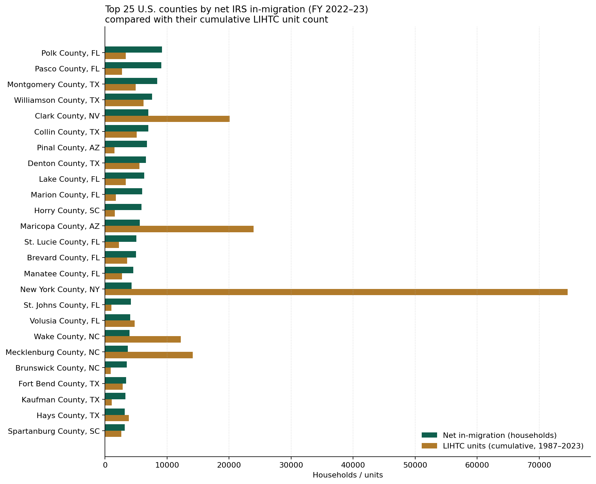

# Migration vs. subsidized housing supply

**Phase 1 demo · 2026-05-23**

For each U.S. county, this view compares the net household-level migration the
county absorbed during IRS Filing Year 2022–23 against the cumulative count of
Low-Income Housing Tax Credit (LIHTC) units placed in service there from 1987
through 2023. Net migration is the difference between households that filed
from the county in the current year versus a different county the year prior
(inflow) and households that did the reverse (outflow).

The top 25 counties by net in-migration are below. The right-hand column
is a rough "supply-per-newcomer" ratio: LIHTC units divided by net in-migrating
households. A low ratio means the affordable-housing supply has not kept pace
with population growth; a high ratio means there's existing capacity to absorb
new arrivals into the regulated stock.

The five largest migration destinations are **Polk County, FL, Pasco County, FL, Montgomery County, TX, Williamson County, TX, Clark County, NV**. The widest gap
between migration pressure and existing LIHTC supply in this cohort is
**Pinal County, AZ** — 6,769 net
in-migrating households against 1,535 LIHTC
units (ratio 0.23). The most-buffered
county in this cohort is **New York County, NY**, with a ratio of
17.32.

## Top 25 counties by net in-migration

| County                 |   Net in-mig HH |   LIHTC units |   LIHTC projects |   LIHTC / in-mig HH |
|:-----------------------|----------------:|--------------:|-----------------:|--------------------:|
| Polk County, FL        |            9193 |          3377 |               30 |                0.37 |
| Pasco County, FL       |            9058 |          2718 |               25 |                0.3  |
| Montgomery County, TX  |            8419 |          4957 |               33 |                0.59 |
| Williamson County, TX  |            7619 |          6222 |               45 |                0.82 |
| Clark County, NV       |            7000 |         20090 |              161 |                2.87 |
| Collin County, TX      |            6995 |          5088 |               37 |                0.73 |
| Pinal County, AZ       |            6769 |          1535 |               21 |                0.23 |
| Denton County, TX      |            6596 |          5559 |               34 |                0.84 |
| Lake County, FL        |            6299 |          3345 |               34 |                0.53 |
| Marion County, FL      |            5980 |          1751 |               17 |                0.29 |
| Horry County, SC       |            5892 |          1577 |               29 |                0.27 |
| Maricopa County, AZ    |            5606 |         23950 |              212 |                4.27 |
| St. Lucie County, FL   |            5050 |          2229 |               12 |                0.44 |
| Brevard County, FL     |            4983 |          3576 |               24 |                0.72 |
| Manatee County, FL     |            4551 |          2723 |               19 |                0.6  |
| New York County, NY    |            4305 |         74570 |              750 |               17.32 |
| St. Johns County, FL   |            4150 |          1012 |                8 |                0.24 |
| Volusia County, FL     |            4075 |          4793 |               35 |                1.18 |
| Wake County, NC        |            3984 |         12233 |              165 |                3.07 |
| Mecklenburg County, NC |            3706 |         14139 |              146 |                3.82 |
| Brunswick County, NC   |            3502 |           950 |               16 |                0.27 |
| Fort Bend County, TX   |            3427 |          2841 |               21 |                0.83 |
| Kaufman County, TX     |            3319 |          1095 |               14 |                0.33 |
| Hays County, TX        |            3204 |          3858 |               22 |                1.2  |
| Spartanburg County, SC |            3166 |          2613 |               34 |                0.83 |

## Sources

- HUD LIHTC Database (placed in service 1987–2023; April 2025 release)
- IRS SOI county-to-county migration data, filing years 2022–2023

## Caveats

- LIHTC unit counts are cumulative since 1987 and include projects whose initial
  15-year compliance period has expired; counts overstate currently rent-restricted
  supply where the project has converted to market-rate.
- IRS migration data captures filers only; it underweights low-income, undocumented,
  and non-filing households, which are exactly the populations most relevant to
  affordable-housing demand. Treat as a directional signal, not a precise demand
  measure.
- This is a national view, not a single-state view. The top destinations are
  dominated by very large metros where both numerators are large in absolute
  terms but small per capita.
