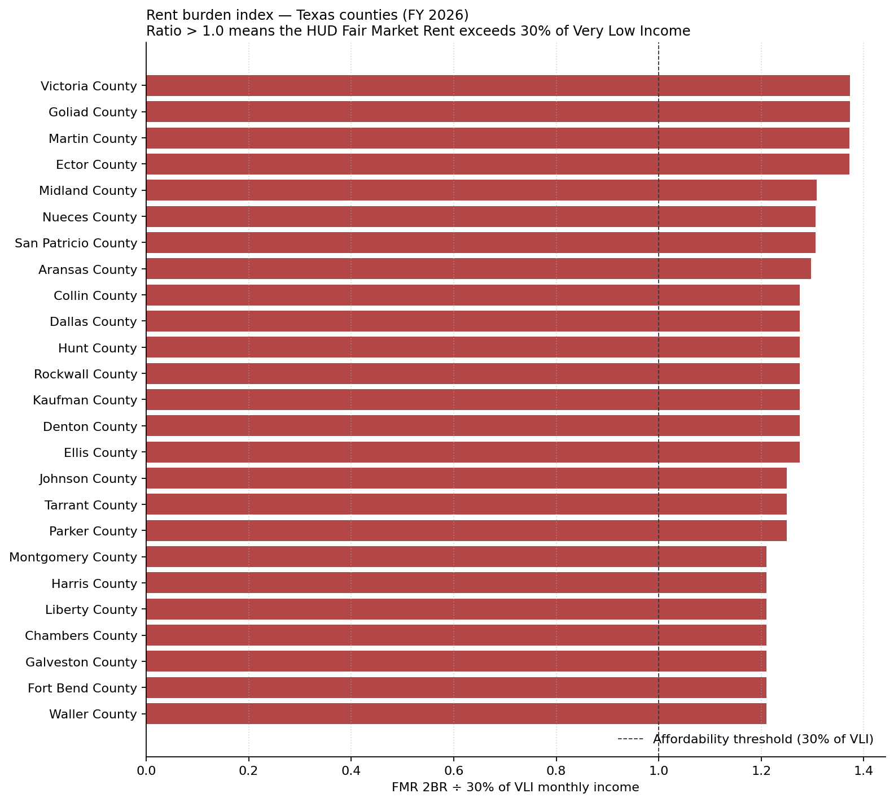

# Rent burden: where "affordable" still isn't

**Texas · FY 2026**

HUD's Fair Market Rent is meant to represent what a modest rental unit costs in
a given market. The Very Low Income limit (50% of Area Median Income) defines
who qualifies for the deepest subsidies. When FMR exceeds 30% of a VLI
household's monthly income, the program's own benchmark rent is unaffordable
to the population it targets — a structural gap, not a personal one.

Of the top 25 Texas counties shown, **25** have a
burden ratio above 1.0 — meaning FMR exceeds the 30%-of-income threshold for
a 4-person VLI household. The most strained is **Victoria County** at
1.37x.

## Top 25 counties by rent burden ratio

| County              | FMR 2BR   | VLI (annual)   | 30% VLI (monthly)   |   Burden ratio |
|:--------------------|:----------|:---------------|:--------------------|---------------:|
| Victoria County     | $1,442    | $42,000        | $1,050              |           1.37 |
| Goliad County       | $1,442    | $42,000        | $1,050              |           1.37 |
| Martin County       | $1,772    | $51,650        | $1,291              |           1.37 |
| Ector County        | $1,595    | $46,500        | $1,162              |           1.37 |
| Midland County      | $1,780    | $54,450        | $1,361              |           1.31 |
| Nueces County       | $1,366    | $41,850        | $1,046              |           1.31 |
| San Patricio County | $1,366    | $41,850        | $1,046              |           1.31 |
| Aransas County      | $1,407    | $43,400        | $1,085              |           1.3  |
| Dallas County       | $1,931    | $60,550        | $1,514              |           1.28 |
| Hunt County         | $1,931    | $60,550        | $1,514              |           1.28 |
| Rockwall County     | $1,931    | $60,550        | $1,514              |           1.28 |
| Collin County       | $1,931    | $60,550        | $1,514              |           1.28 |
| Kaufman County      | $1,931    | $60,550        | $1,514              |           1.28 |
| Denton County       | $1,931    | $60,550        | $1,514              |           1.28 |
| Ellis County        | $1,931    | $60,550        | $1,514              |           1.28 |
| Johnson County      | $1,723    | $55,150        | $1,379              |           1.25 |
| Tarrant County      | $1,723    | $55,150        | $1,379              |           1.25 |
| Parker County       | $1,723    | $55,150        | $1,379              |           1.25 |
| Harris County       | $1,573    | $52,000        | $1,300              |           1.21 |
| Liberty County      | $1,573    | $52,000        | $1,300              |           1.21 |
| Chambers County     | $1,573    | $52,000        | $1,300              |           1.21 |
| Galveston County    | $1,573    | $52,000        | $1,300              |           1.21 |
| Fort Bend County    | $1,573    | $52,000        | $1,300              |           1.21 |
| Montgomery County   | $1,573    | $52,000        | $1,300              |           1.21 |
| Waller County       | $1,573    | $52,000        | $1,300              |           1.21 |

## Sources

- HUD FY 2026 Fair Market Rents (revised)
- HUD FY 2026 Section 8 Income Limits

## Interpretation note

A burden ratio below 1.0 does not mean affordable housing is plentiful — it
means the FMR is *mathematically* within reach for VLI households. Whether
units are actually *available* at FMR is a separate question this data does
not answer.
