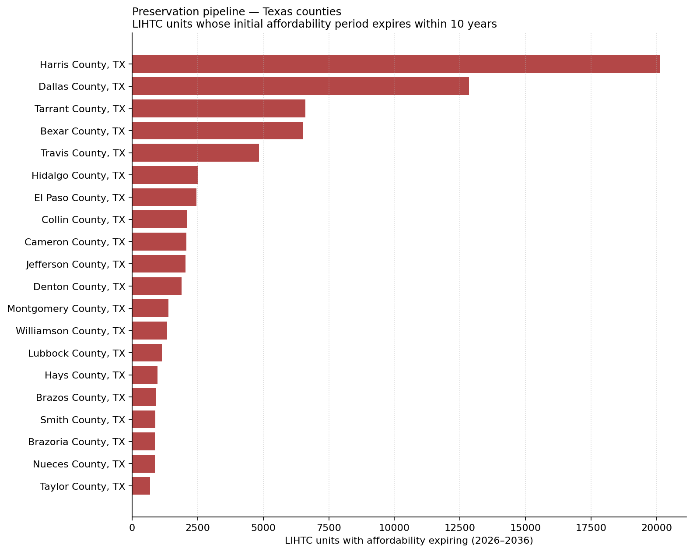

# Subsidy expirations: the preservation pipeline

**Texas · as of 2026**

Every LIHTC project has a recorded affordability period — typically 15 or 30
years from when it was placed in service. Once that period expires, the owner
is no longer required to maintain below-market rents. Projects approaching
expiration are the primary pipeline for preservation acquisitions: buy them,
re-syndicate or restructure, and lock in another 30 years of affordability.

Of **266,007** total LIHTC units in Texas with computable
expirations:

- **31,183** units expire within 5 years (2026–2031)
- **89,773** units expire within 10 years (2026–2036)
- **18,622** units have *already* passed their initial affordability period

The chart and table below show which counties have the deepest near-term
preservation pipeline.

## Top 20 counties by units expiring within 10 years

| County                |   Units expiring |   Projects expiring |
|:----------------------|-----------------:|--------------------:|
| Harris County, TX     |            20127 |                 102 |
| Dallas County, TX     |            12844 |                  69 |
| Tarrant County, TX    |             6599 |                  35 |
| Bexar County, TX      |             6520 |                  37 |
| Travis County, TX     |             4832 |                  28 |
| Hidalgo County, TX    |             2520 |                  24 |
| El Paso County, TX    |             2458 |                  43 |
| Collin County, TX     |             2081 |                  14 |
| Cameron County, TX    |             2069 |                  16 |
| Jefferson County, TX  |             2042 |                  12 |
| Denton County, TX     |             1892 |                  13 |
| Montgomery County, TX |             1384 |                   8 |
| Williamson County, TX |             1334 |                   8 |
| Lubbock County, TX    |             1132 |                   7 |
| Hays County, TX       |              966 |                   8 |
| Brazos County, TX     |              916 |                   7 |
| Smith County, TX      |              884 |                   6 |
| Brazoria County, TX   |              864 |                   6 |
| Nueces County, TX     |              860 |                   6 |
| Taylor County, TX     |              686 |                   5 |

## Sources

- HUD LIHTC Database (1987–2023; `yr_pis` + `aff_yrs` = expiration year)

## Caveats

- Many projects extend beyond the initial affordability period via extended-use
  agreements, re-syndication, or other regulatory mechanisms. An "expired"
  affordability period does not necessarily mean the project has converted to
  market-rate — but it means it *can*.
- Projects with missing `yr_pis` or `aff_yrs` are excluded from this analysis.
