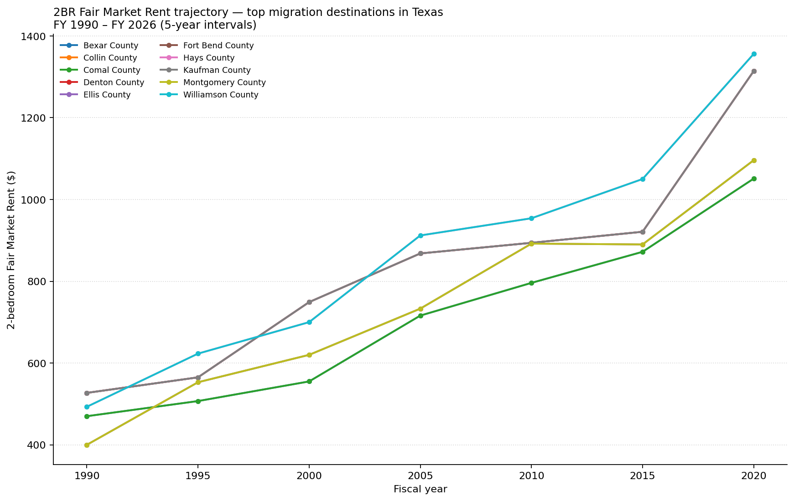

# Rent trajectory: are destination markets getting more expensive?

**Texas · FY 1990–2026**

This chart tracks the 2-bedroom Fair Market Rent over ~35 years for the
Texas counties absorbing the most net in-migration (per IRS data,
FY 2022–23). The question it answers: are the places people are moving to
*also* the places where rents are climbing fastest?

## Growth summary

No data available.

## Sources

- HUD Fair Market Rents (all bedroom sizes, 1983–2026)
- IRS SOI county-to-county migration data, filing years 2022–2023

## Interpretation

FMR growth reflects HUD's estimate of what *modest* rental units cost, not
luxury or median rent. Where FMR growth outpaces income growth, the
affordable-housing gap widens even before considering population pressure
from in-migration.
